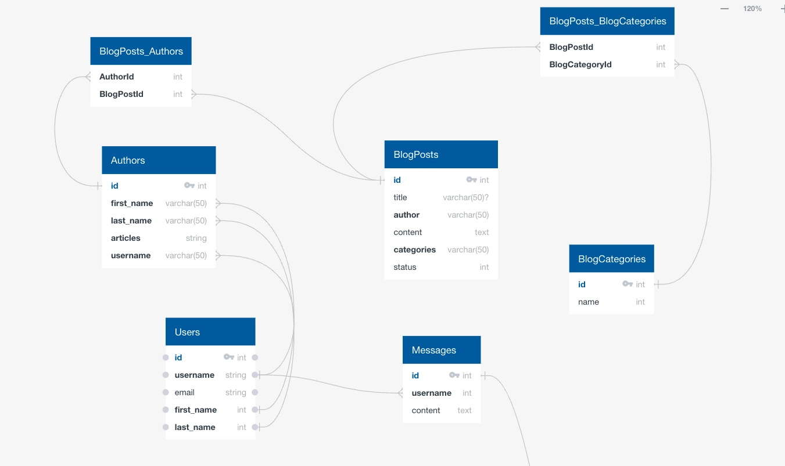
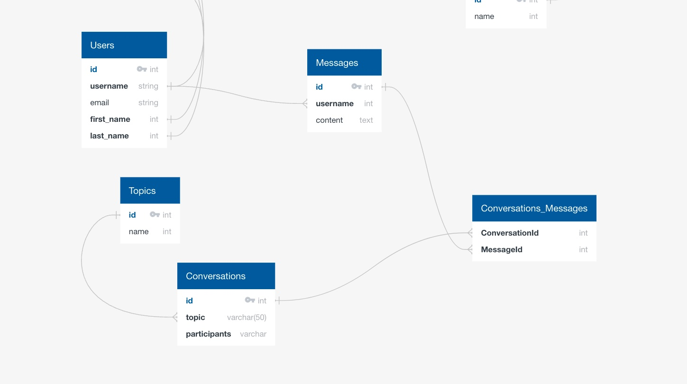
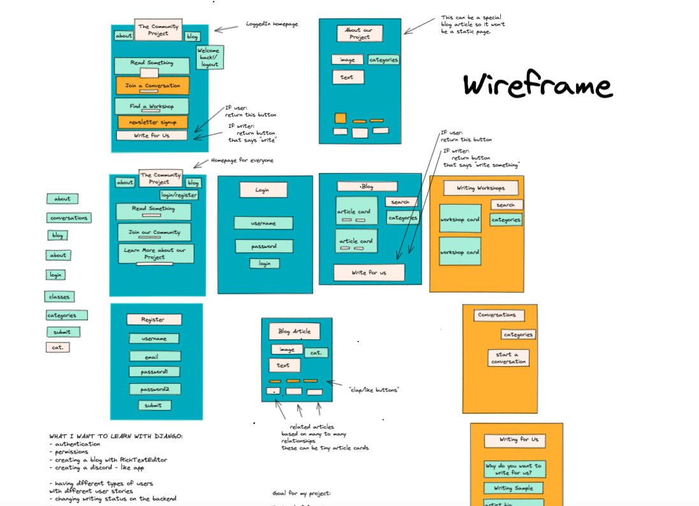
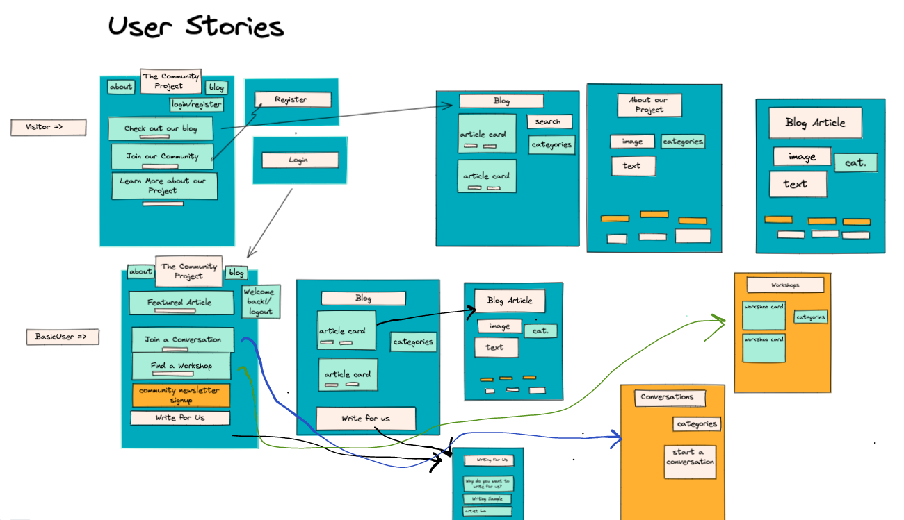
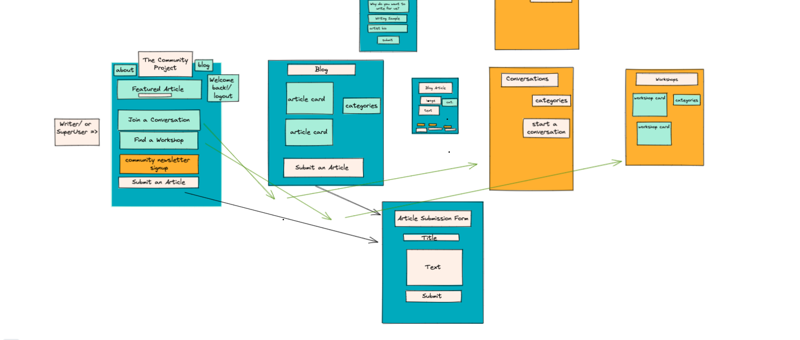

#  Project #4: The Community Project 

**This is my fourth and final project for GA's Software Engineering Immersive course.** 

**I built a full-stack application** with a Python Django REST framework API and a React frontend with Tailwind styling. 
It's called The Community Project, and the idea was to make a template for a potential community website that I might build for friends or future clients looking to build an online community. 

*Here's a quick look at The Community Project homepage:*


## Goal 
Solo project where I built a full-stack web app with React, a Python Django API and a PostgreSQL database. 

**Timeframe**

Two weeks (35 course hours)

## Technologies used 

- Python 
- Django REST framework
- Poetry 
- JavaScript
- JSX
- PostgreSQL
- Insomnia 
- React 
- React Router/Dom
- Tailwind
- VSCode
- Git/GitHub
- Excalidraw
- QuickDB
- Trello 
- **[unDraw images](https://undraw.co/)**
- Heroku
- Netlify
- Table Plus

## Project brief 

Following the project specifications for a Project 4 MVP, I did the following: 

* **Built a full-stack application** making my own backend with Django using the Poetry package manager.
* **Used a Python Django API** Django REST Framework served my data to the API from a PostgreSQL database. I used Table Plus to view the data in my database. 
* **Built a separate front end for my API** - I did this with React. 
* **Made a complete product** - My API has 4 models all with CRUD functionality. I was able to implement some of this functionality on the frontend with user registration and login. 
* **Implemented thoughtful user stories** - I built a wireframe and user stories with Excalidraw. These stories were detailed enough that I knew the Basic User story was my target MVP. 
* **Implemented a visually impressive design** - As encouraged by my instructors, I took time to present a design I'm proud of and made sure at the beginning of week 2 of the project that I was learning the styling library I'd chosen, Tailwind. This also gave me the opportunity to use open source images from unDraw. 
* **Deployed the project online** - Here is the frontend **[The Community Project Front End](https://capable-bunny-0040ae.netlify.app/)**. And here is the backend **[The Community Project Backend](https://the-community-project.herokuapp.com/)**

# The Community Project

I love the idea of community and people connecting positively over activities or ideas they love. My idea was to use this project to build a backend that I might use for friends who are looking to build a community page for their own passions. This version of the project has a blog and login and register function. 


#### Interested in the actually thing? Check out the deployed version here: 

**[The Community Project Frontend](https://capable-bunny-0040ae.netlify.app/)**

## Planning 

I took a day or two to plan my project by working on both a wireframe using Excalidraw and database diagrams using QuickDB. These planning tools allowed me to visualise what data I wanted available on my frontend and in turn how my Django app models needed to be set up and relate to each other in the backend. I then was able to have an idea of the different routes to set up with my API. 

I loved this API design process and found that taking this time to understand my API allowed me to feel more comfortable and confident when I started coding the backend with the Python Django framework. 

Below is an explanation of my database diagrams and wireframes: 

### Database Diagrams

With the Python Django framework, it was important to draw database diagrams. I knew I'd want a User, Author, Blogpost, Blog comment, and Blog category classes in Django. Other models in the database diagram that I didn't end up coding were Conversations and Conversation topics for a possible chatroom feature. I built my models using QuickDB, which helped visualize one-to-one, one-to-many, and many-to-many relationships. What I enjoyed about this part was thinking about how the data I wanted to eventually consume with a frontend needed to be designed in the backend. 





It took an entire class session to get these models right. 

### Wireframes and User Stories 

Once my database diagrams were ready to go, I used Excalidraw to sketch a wireframe and then to think about user stories. User stories were a new concept to me. As I planned to have visitors, basic users, and staff writers for this project, I sketched out a story for each type of user. While I didn't code all my ideas for all of these users, I found the exercise to be quite useful and even enjoyable. 

*Here's my wireframe.*



*And here are my user stories.*

These are for a "visitor" and a "basic user":



This one is for the "staff writer" or Django's "superuser":



As you can see, I had some ambitious ideas! 

## Development

In this section I talk about some difficulties I had starting to code the backend Django project and then look at a few key pieces of code that I'm proud of from the backend and the frontend. 

### Getting off to a rough start 
With my wireframes and user stories drafted, I booted up the VSCode and started my new Django project. To be honest, my backend adventures got off to a rough start. Setting up my models, which Django uses the term "app" for, I got a lot of errors with my Blog Post app and there were problems migrating the apps into my TablePlus database. Long story short, on day 2 of coding, I cut my losses, deleted everything and started a new Django project from scratch. This wasn't fun, but definitely a good learning experience as our instructors encouraged us to write code we might eventually delete. 

### Backend CRUD functionality

In comparison to the MERN Stack application that I made in Project 3, the Django REST Framework offered a different kind of complexity. I'm proud of all the Django apps in my backend having full CRUD functionality. This project allowed me to more deeply understand serializers as well as authentication and permissions in the Python Django framework. 

#### Authentication and permissions working with serializers

In my API, when a user wants to post a blog post, the serializer checks that the user has the status of writer. 

This piece of code allows the user to update their profile and checks that the individual updating the profile is in fact the user. 

```
class ProfileEditSerializer(serializers.ModelSerializer):

    class Meta:
        model = CommunityUser
        fields = ('username', 'first_name',
                  'last_name', 'email', 'bio',)

        extra_kwargs = {
            'first_name': {'required': True},
            'last_name': {'required': True},
            'username': {'required': True},
            'email': {'required': True}
        }

    def validate(self, attrs):
        request = self.context.get("request")
        username = self.context.get("username")
        print("attributes", attrs)
        if request and hasattr(request, "user"):
            if attrs['username'] != request.user.username:
                raise serializers.ValidationError({
                    "not_user": "Woops! What are you doing here? Only the person who made this profile can update it."
                })

        print("attributes", attrs)

        return attrs

    def update(self, userprofile, data):

        userprofile.username = data.get("username", userprofile.username)
        userprofile.first_name = data.get(
            "first_name", userprofile.first_name)
        userprofile.last_name = data.get(
            "last_name", userprofile.last_name)
        userprofile.email = data.get("email", userprofile.email)
        userprofile.bio = data.get("bio", userprofile.bio)

    # save to the database
        userprofile.save()
        print("userprofile", userprofile.email)
    # render to the api
        return userprofile

```
And here are the AuthorSerializer and part of the BlogPostSerializer, which verify that the user is in fact a "staff_writer" before they can create a blog post. 

```

class AuthorSerializer(serializers.ModelSerializer):
    class Meta:
        model = CommunityUser
        fields = ('first_name', 'last_name', 'id', 'profile_image', 'bio')

        def validate(self, attrs):
            request = self.context.get("request")
            if request and hasattr(request, "user"):
                if request.user.is_staff_writer == False:
                    raise serializers.ValidationError(
                        {"message": "Only Staff Writers can post or update an article."}
                    )

            return attrs


class BlogPostSerializer(serializers.ModelSerializer):
    categories = CategorySerializer(many=True)
    author = AuthorSerializer()

    class Meta:
        model = BlogPost
        fields = ('categories', 'author', 'title', 'image',
                  'excerpt', 'content', 'status', 'id')

```

### Front end noteworthy features 
In the second week of the project, I turned my focus to building the frontend. I'm proud of working with props and implementing user authentication on the frontend. 

#### Working with props
 In the gif above, you can see that the logged in user is "communityadvocate" where it says in the navbar, "Welcome back, communityadvocate!" I talk more about this feature in the section below that stores the username as a state variable in local storage with setUsername(username).

#### Authentication
In my previous project, I didn't focus on authentication in the front end, so it was important to make this a key feature of my project. 

The following is the code for logging in a user and using props to indicate in the App.js file if the user is loggedIn or loggedOut. 

```
const onLogin = async (e) => {
        e.preventDefault()
        try {
            const response = await axios.post(`${API_URL}/api/token/`, formData)
            const result = await response
            console.log(result)

            if (response.statusText === "OK") {
                console.log("ok")
                setAccessToken(response.data.access)
                setRefreshToken(response.data.refresh)
                setUsername(formData.username)
                setIsStaffWriter(response.data.is_staff_writer)
                console.log("Successful login for", formData.username)
                const username = formData.username
                props.onLogin(username)
                navigate("/homepage")
            }

        }

```
Here is the code from the App.js file that uses this prop to set the users status as LoggedIn and set the username. 

```
<Route
            path="login"
            element={<Login
              onLogin={(username, userStatus) => {
                setLoggedIn(true)
                setUser(username)
                setIsStaffWriter(true)
              }} />} />
```


## Deployment and Styling 

On day 12 of the project, I deployed my Python Django API to Heroku. I got an error message that Gunicorn was "failing to boot workers". I found **[this helpful article](https://help.heroku.com/HX4L23I4/debugging-deploy-issues-with-gunicorn)** that walked me through the steps of sorting this issue out. I was able to deploy the frontend on Netlify the next day but encountered CORS issues that persisted until after the project presentation but have been resolved. 

In the last week of the project, I had fun playing around with Tailwind styling. One of the features I appreciate about this styling library is that it is mobile-first, and my application can be viewed on a mobile device as well as a laptop. This is a feature my other projects don't have. 

## Wins 

- A user is able to register and login on the front end and then logout. 
- My Django backend apps all have CRUD functionality that includes authorization and permissions. 
- Using the unDraw images, I built a fully functioning app that looks good. 


## Challenges
 - As I mentioned in the development section, I was getting a lot of errors by day 2 of coding which was super frustrating, so I started the project over halfway through the first project week. 
 - Understanding how Django framework serializers work was a big challenge, and I enjoyed the workshops offered by our instructor during this project because it helped me and the other students talk through the code of how serializers work. 

 - Not knowing what I didn't know: 1) I researched and implemented a RichTextEditor in my backend that I thought would help me with the Blog Post Django app. It turned out that this is not compatible with a React frontend. I spent a good morning getting it all set up, and then ended up removing it completely later on. I then tried the Quill Editor on the front end and read and watched tutorials but couldn't get that to work either. 2) Django REST framework has an isAuthenticated permissions setting that I thought worked on all API call methods, but it doesn't, and I spent an entire afternoon wondering why my update user function was getting errors. This made me realise returning to the documentation when I'm getting permission errors could be the right thing to do. I ended up working on this one with my instructor.      

 - Both my backend and front end were deployed to Heroku and Netlify, respectively, before the project deadline, but I ran into CORS issues that blocked my front end from accessing the backend. I didn't panic and ran the project from my local host for my presentation and after a couple days of rest was able to appropriately adjust the CORS permissions that allowed the frontend to make requests to my API. 

## Key learnings 

I feel like with each successive project, I find that there are features I work on in the process that don't see the light of day in the deployed frontend but it's all par for the course. 

Here are a few things that I learned from this project: 
 - It's totally ok to cut your losses and delete your project and start over. 
 - Projects are still a learning experience. Our instructor during this project offered mini workshops on features the group was struggling with, and at times I found it frustrating because I wanted to work on my project, but then realised that reworking and revisiting certain concepts, for example, authentication and permissions with the Django REST framework serializers, was a way of solidifying my understanding of the programming concept I was implementing in my project. A project is a journey, not a destination. 
 - In one of these workshops we were introduced to TypeScript. I didn't end up using this technology but enjoyed having some exposure to it. 
 - Using props in React. 
 - Working with images in my database. 
 - My wireframe was a bit ambitious for this project's scale. 
- Learning a new styling library was fun especially since Tailwind has cool features out of the box. 
- Differences between relational and non-relational databases.


## If I'd had more time...
 
 - My frontend blog would have a comment function. This functionality works in the backend, but I didn't have time to implement it in the frontend. 
 - My blog posts would be able to be sorted by category. 
 - I really wanted to implement a search bar, also another feature for another day.
 - A user would have a profile page they could update. 

